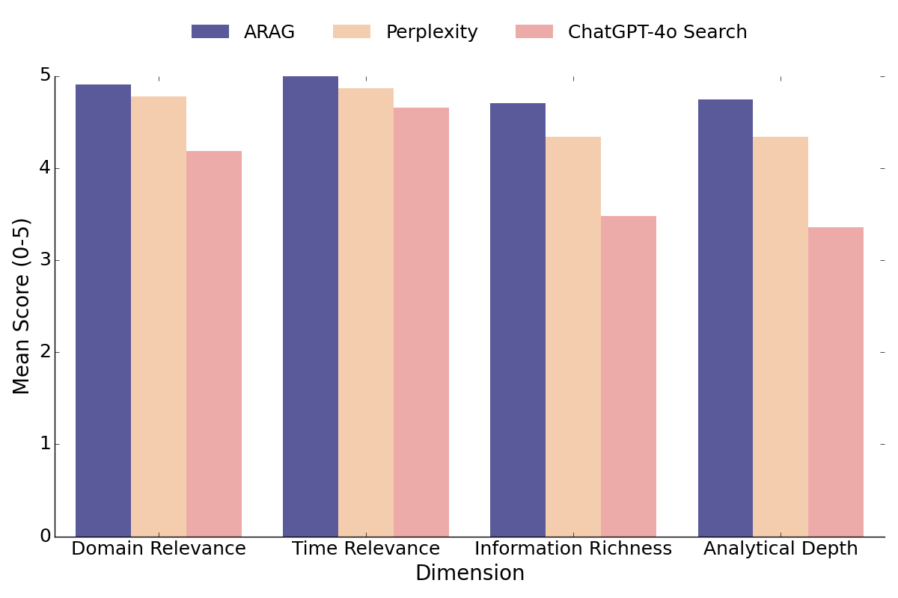
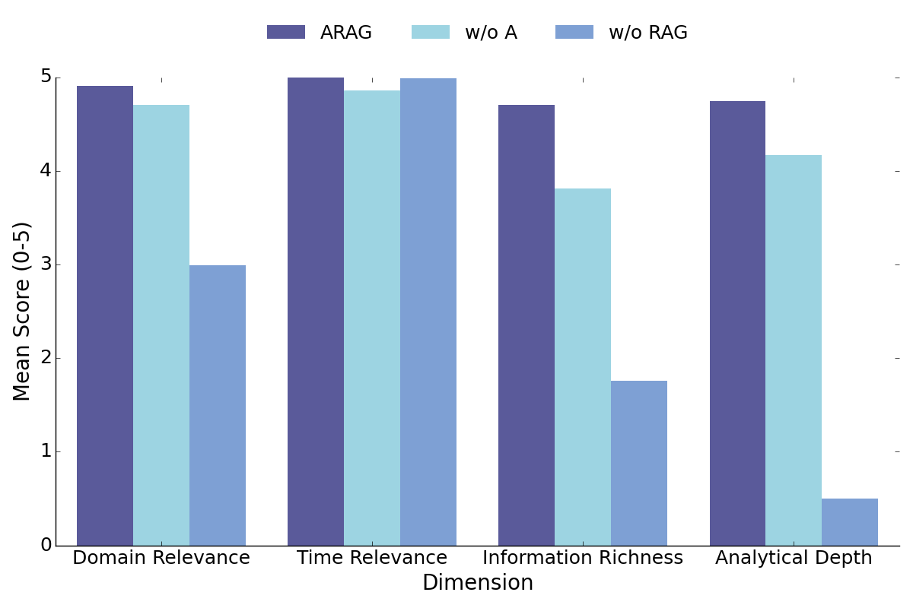

  <h1 align="center">ARAG: Analysis and Retrieval Augmented Generation for Comprehensive Reasoning over Socioeconomic Data (Performance Evaluation)
</h1>

## Abstract
Recent advancements in Large Language Models (LLMs) have significantly impacted the field of question answering systems, particularly with LLM-based data analysis and Retrieval-Augmented Generation (RAG). Yet, their independent application has limited the scope in scenarios requiring a synthesis of both data analysis and contemporary information retrieval. To bridge this gap, we introduce the Analysis and Retrieval Augmented Generation (ARAG) framework, which blends data analysis with the retrieval of up-to-date information. Based on the framework, we build a system for interpreting the dynamics of socioeconomic indicators and how ARAG explores the reasons behind the indicators' dynamics through data analysis of correlated indicators and retrieval of relevant facts from news sources. The comparison of ARAG with Microsoft Copilot and Perplexity showed that ARAG significantly outperformed in delivering in-depth analytical insights and was remarkably more robust to misinformation across various queries.

## Results
<table border="0" style="border: none;">
  <tr>
    <td>
       
      <em>Chart 1: This is an example result chart, showing some key metrics of the evaluation results.</em>
    </td>
    <td style="padding-left: 20px;">
       
      <em>Chart 2: Another results chart, providing a comparison across different evaluation dimensions.</em>
    </td>
  </tr>
</table>

## Data
- `arag_results.xlsx`: Responses of ARAG, MS Copilot, and Perplexity over 50 queries (Chinese). 
- `arag_results_en.xlsx`: Responses of ARAG, MS Copilot, and Perplexity in English traslated via ERNIE Bot 4.0. 
## Result Files
- `arag_results.xlsx`: Evaluation results ARAG, MS Copilot, and Perplexity over 50 queries and 10 realizations.
- `average_scores.csv`: Average socres of ARAG, MS Copilot, and Perplexity over 50 queries. 
